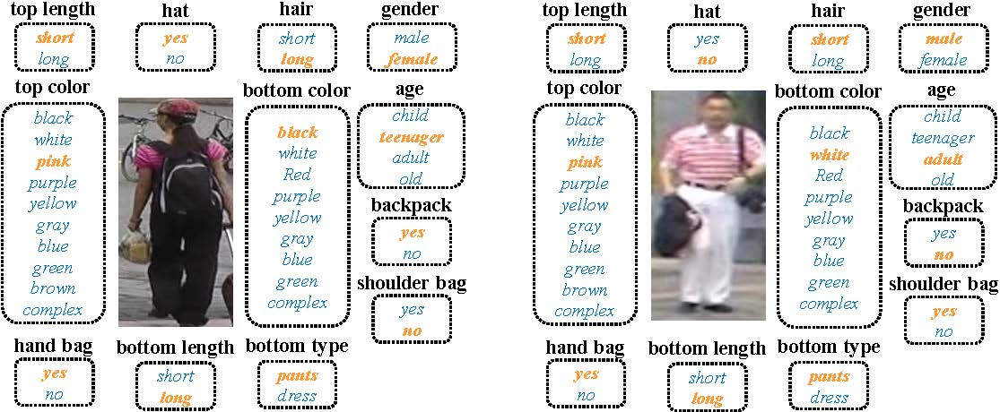

# MARS-Attribute
## Vedio-based person attributes with trackets-level labels based on the MARS dataset.
We labeled 32 attributes for [MARS](http://www.liangzheng.com.cn/1320.pdf), the definition of the attributes is from the [MARKET-1501_Attribute](https://github.com/vana77/Market-1501_Attribute), the main difference between these two attributes dataset is that [MARKET-1501_Attribute](https://github.com/vana77/Market-1501_Attribute) is instance-level, while ours is **trackets-level**.

The detailed information of MARS can be found at http://www.liangzheng.com.cn/Project/project_mars.html, for the reason that in the test-set of MARS, the trackets which belong to the ID "0000" and "00-1" is junk images and distractors, which can't be used to do perdestrian attribute recognition, so these trackets is excluded from the MARS-attribute dataset.

## Explanition of the data
The original vedio-data of MARS is accessible on http://www.liangzheng.com.cn/Project/project_mars.html. And the attributes data is organized as follows:

| person-id | camera | tracklet | Tops.c | Bottoms.c | Age | Tops.l | Bottoms.l | shoulder bag | backpack | hat | handbag | hair | gender | Bottoms.t |
| --: | --: | --: | --: | --: | --: | --: | --: | --: | --: | --: | --: | --: | --: | --: |
| 1 | 2 | 58 | 8 | 0 | 1 | 1 | 1 | 0 | 0 | 0 | 0 | 1 | 1 | 0 |

The trackets of MARS can be identified by three attributes person-id, camera-id and tracket number, and for each tracket, 32 attributes is given.

Since several attributes is mutual exclusive, such as the color of tops, the color of downs, and the age, so we combine the 32 attributes ino 12 kinds, which is shown in the figure and the example table.

**For the Tops.c attribute, the value 0~8 means the color of tops is \[black, uppurple, upgreen, upblue, upgray, upwhite, upyellow, upred, upcomplex\]**

**For the Bottoms.c attribute, the value 0~9 means the color of bottoms is \[white, purple, black, green, dgray, pink, yellow, blue, brown, complex\]**

**For the Age attribute, the value 0~3 means the age is \[young, teenager, adult, old\]**

## Motion attributes
Except for the original 32 attributes, we also labeled several motion attributes as well as quality attributes,  and these motion attributes would be published soon.

DukeMTMC-VID is annoted with the expend attributes definitions, which would also be published soon.

